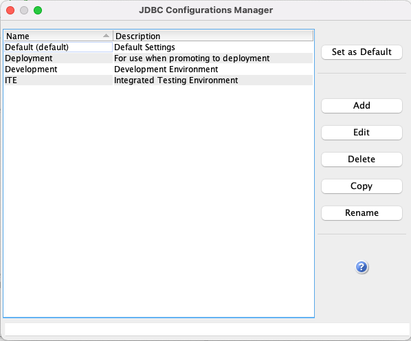
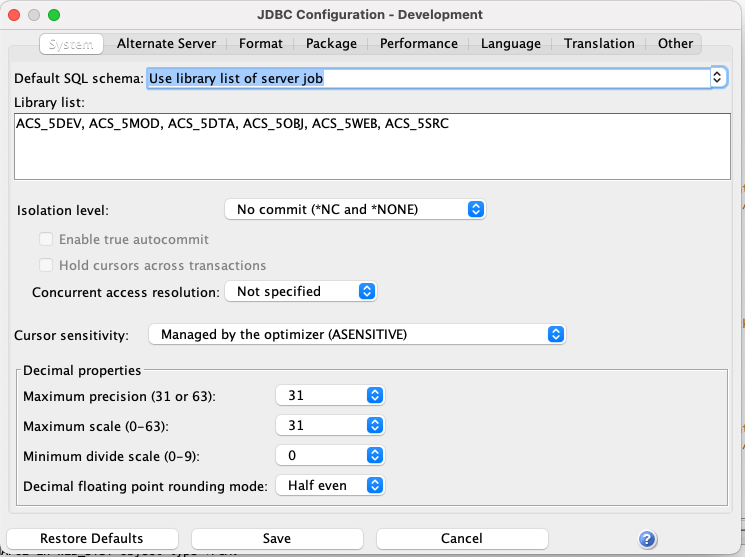
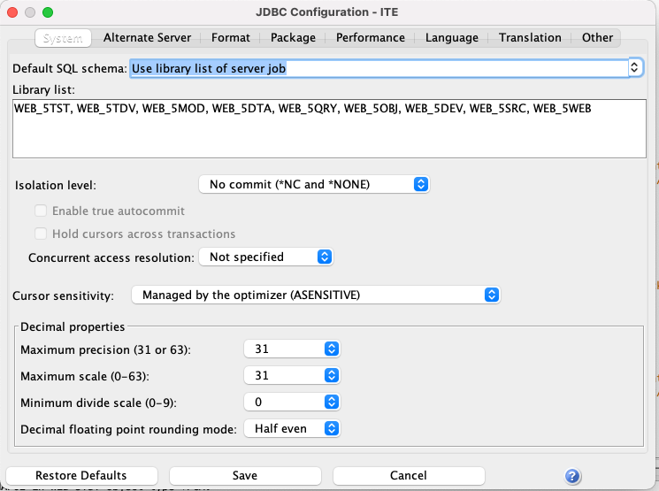
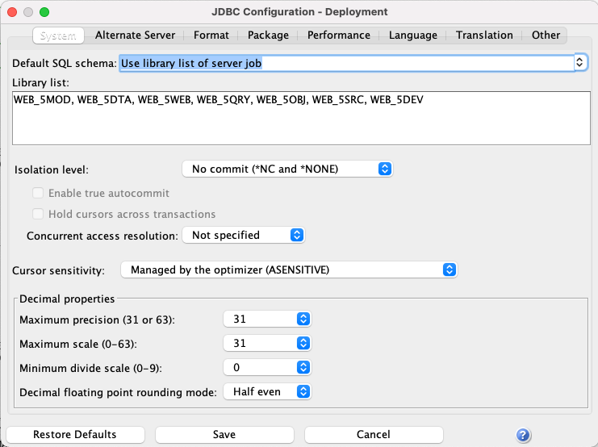
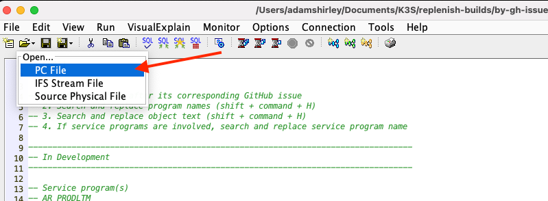
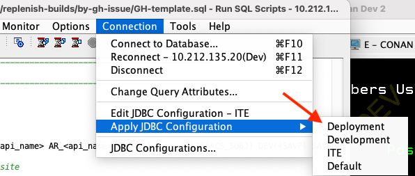

# Replenish Builds

This project includes the CL commands necessary for building and promoting API source code. Currently there is one .sql file per github issue, and the commands are intended to be run from Access Client Solutions - Run SQL Scripts. 

## Setup
The commands in the .sql files assume that you have one library list for each environment. Within Run SQL Scripts, this requires one JDBC configuration per environment.

### Development Configuration
Your development configuration should look something like this:

### ITE Configuration
Your configuration for the Integrated Testing Environment should look something like this:

### Deployment Configuration
Lastly, your configuration for deployment should look something like this:

## Creating A Build Script
In order to create a new build script that corresponds to a certain GitHub issue on the K3S-Replenish-RPG repository, copy the file called GH-template.sql and name the file according to the GitHub issue number (e.g., GH455 for issue number 455). Once that file is created, open it with Run SQL Scripts.

Now follow the steps in the comments of the template. These will allow you to quickly set values throughout the file including the API program names, service program names, and text descriptions.

Notice that there are four sections within the file that represent the four steps you will take when developing and promoting the source code. The commands within the development, ITE, and deployment sections are intended to be run with their corresponding JDBC configurations. You can quickly switch configurations by selecting Connection -> Apply JDBC Configuration in the Run SQL Scripts menu.

Once you have applied the appropriate JDBC configuration, you can highlight the commands for the environment that you're working in and press command + R to "Run Selected." Compilation output will be in your spooled files.